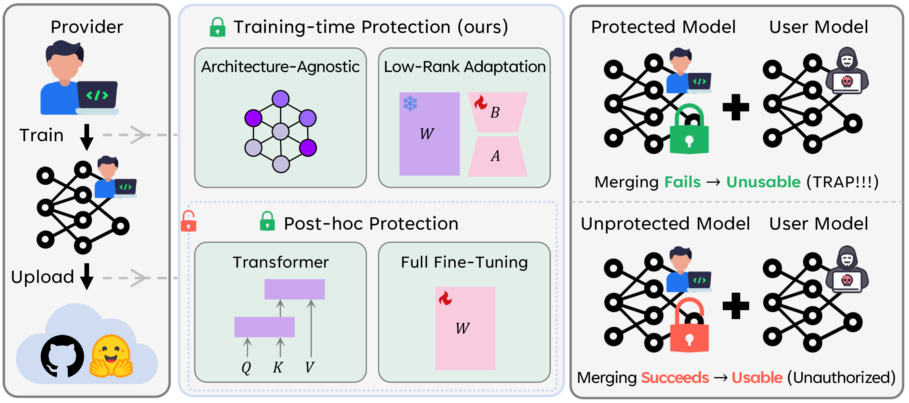

# Trap²

🔗 **Project Page:** [Link](https://pseudope.github.io/Trap2/)

The official project page of the paper "Making Models Unmergeable via Scaling-Sensitive Loss Landscape", which has been accepted in ICML 2026.

## Overview of Trap²

## Acknowledgments

This page was built using the [Academic Project Page Template](https://github.com/eliahuhorwitz/Academic-project-page-template) which was adopted from the [Nerfies](https://nerfies.github.io) project page.

## Website License

This work is licensed under a [Creative Commons Attribution-ShareAlike 4.0 International License](http://creativecommons.org/licenses/by-sa/4.0/).
